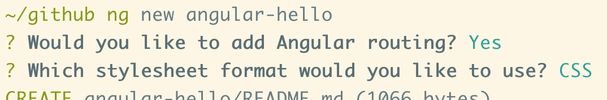
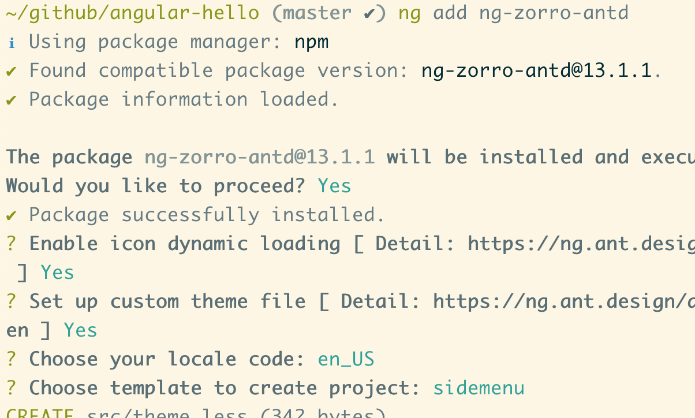

# AngularHello

## 初始化项目

执行 `ng new angular-hello` 来新建一个项目。如果没有 `ng` ，就先 `npm install -g @angular/cli` 。



## 引入 ng-zorro-antd

执行 `ng add ng-zorro-antd` 。



## 新建用户管理模块

简单点，用户管理模块包含一个用户列表页面和一个查看用户操作日志页面即可。

```sh
# 先创建带路由的模块
ng generate module pages/user --routing
# 再创建两个页面的组件
ng generate component pages/user/list
ng generate component pages/user/log
```

然后要在 `src/app/pages/user/user-routing.module.ts` 中修改下 routes ，把两个页面加进去。

```js
import { ListComponent } from './list/list.component'
import { LogComponent } from './log/log.component'

const routes: Routes = [
  { path: '', component: ListComponent },
  { path: 'log/:id', component: LogComponent },
]
```

最后还需要在 `src/app/app-routing.module.ts` 中的 routes 中加入用户模块。

```js
{
  path: 'user',
  loadChildren: () =>
      import('./pages/user/user.module').then((m) => m.UserModule),
},
```

这时候浏览器访问 `/user` 和 `/user/log/1` 页面上就显示的是对应的内容了。最后的最后，我们在左侧菜单栏加一下用户管理模块入口就好了，编辑 `src/app/app.component.html` 即可。

其余功能点见 commit 信息。
